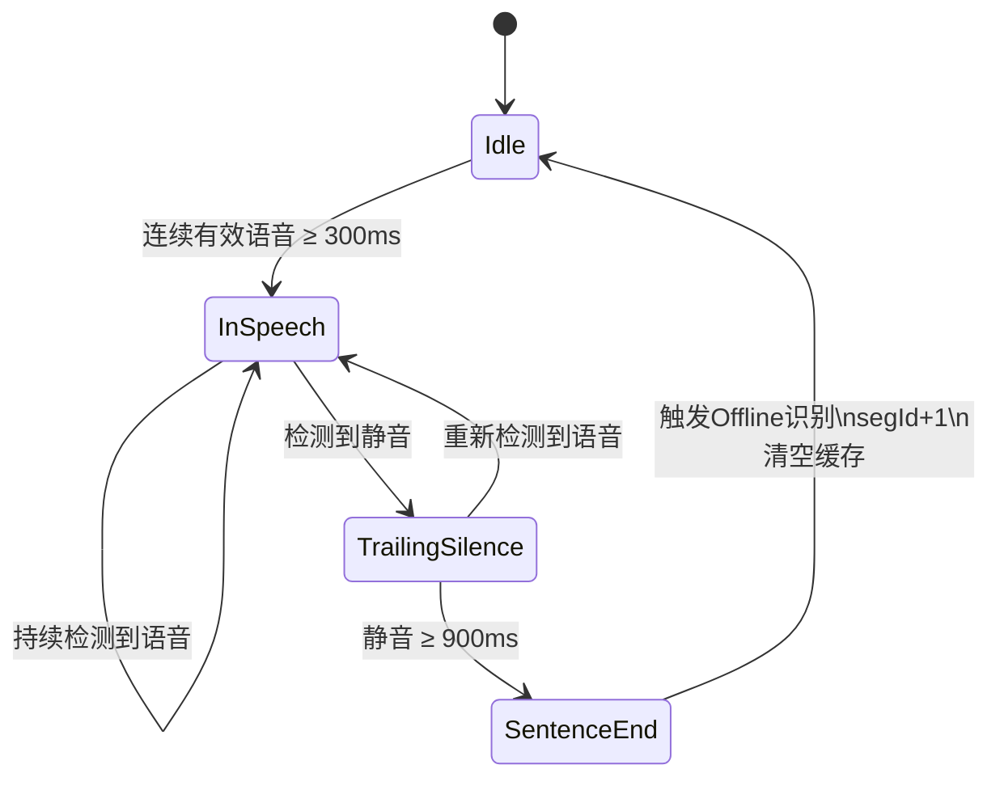

# 实时语音转录服务 – 系统设计文档

## 1. 项目概述

本项目实现一个基于 WebSocket 的高并发、低延迟实时语音转录服务。

客户端每40ms, 持续上传16kHz 16bit音频流，服务端采用 **Online 实时识别** 与 **Offline 高精度识别** 双阶段处理架构：

* **Online 阶段**：负责低延迟实时转录，持续向客户端推送中间识别结果；
* **Offline 阶段**：负责句级高精度识别与文本规范化处理，在检测到语音结束后输出最终结果。

系统通过 VAD（Voice Activity Detection）实现实时端点检测，并基于结构化消息协议向客户端返回转录结果。

---


## 1.1 核心处理流程

```mermaid
flowchart LR
    subgraph ONLINE["Online（实时低延迟）"]
        direction TB
        Init[初始化<br>segId=0]
        WebSocket_IN["客户端接收每40ms音频"]
        Opus["Opus 解码（40ms/帧）"]
        RNNoise["RNNoise 降噪（40ms/帧）"]
        Buffer["Online音频缓冲区<br>（累积当前语音段 PCM）"]
        Cond{"在线空闲<br>且新增 ≥ 400ms?"}
        SetBusy["标记在线忙碌"]
        ASR_Online["ASR-0.6B vLLM<br>（实时在线识别）"]
        FilterHallucTextOnline["丢弃幻觉文本<br>（黑名单+规则）"]
        StripPunct["去除末尾标点"]
        ClearBusy["清除忙碌标志"]

        Init --> WebSocket_IN -->|音频帧| Opus
        Opus --> RNNoise
        RNNoise -->|PCM 数据| Buffer
        Buffer --> Cond
        Cond -- 是 --> SetBusy --> ASR_Online
        Cond -- 否 --> Buffer
        ASR_Online --> FilterHallucTextOnline --> StripPunct
        ASR_Online --> ClearBusy-->Buffer
    end

    subgraph CompletedSentence["端点检测 （CompletedSentence）"]
        direction TB
        VAD["VAD 实时端点检测<br>（40ms/帧）"]
        SilenceAccum["有效语音300ms → 静音 <br> 200ms静音+299ms有效音+200ms静音==699ms静音"]
        SilenceCheck{"静音 > 900ms?<br>（判定句末）"}
       
        VAD --> SilenceAccum --> SilenceCheck
        SilenceCheck -->|否| SilenceAccum
    end

    subgraph OFFLINE["Offline（高精度）"]
        direction TB
        ASR_Offline["ASR-1.7B vLLM<br>（离线高精度识别）"]
        FilterHallucTextOffline["丢弃幻觉文本<br>（黑名单+规则）"]
        IncressSegID["segId+1"]
        ITN["ITN（逆文本正则化）"]
        ASR_Offline --> FilterHallucTextOffline --> IncressSegID --> ITN
        
    end

    subgraph OUTPUT["消息推送"]
        direction TB
        WebSocket_OUT["ws.send_text()<br>发送至客户端"]
    end

    %% ===== 跨子图的边统一放在顶层，避免节点被错误归入子图 =====
    RNNoise -->|PCM 40ms| VAD
    ITN -->|msgType=sentence <br> segId| WebSocket_OUT
    StripPunct --> |msgType=Progressive <br> segId|WebSocket_OUT
    SilenceCheck -->|是，有效语音≥900ms<br>触发 Offline| ASR_Offline
    SilenceCheck -.->|清空Online音频缓冲区| Buffer
```


---


## 1.2 处理流程说明

### 音频预处理

客户端通过 WebSocket 每 40ms 持续发送一帧 16kHz / 16bit 音频。

服务端按帧（40ms/帧）处理：

1. 若 `payload.audio.encoding == "opus"`，对音频帧进行 Opus 解码（每连接独立解码器）；否则直接透传 PCM；
2. 对 PCM 执行 RNNoise 降噪（40ms/帧）；
3. 将降噪后的 PCM 同时送入两条链路：
   * **VAD 实时端点检测模块**（40ms/帧）；
   * **Online ASR 音频缓冲区**（累积当前语音段 PCM）。

---

### Online 实时识别（msgtype = Progressive）

Online ASR 采用 **「整段累积缓冲 + 新增增量触发」** 策略。

降噪后的 PCM 持续写入 Online 缓冲区，缓冲区保存**当前语音段的完整 PCM**，在Offline推理前不清空。

触发需同时满足：

* Online ASR 当前**空闲**（当前客户端无正在进行的在线识别，不影响其他客户端的转录）；
* 自上一次在线识别触发以来，**新增音频 ≥ 400 ms**。

同时满足时，标记「在线忙碌」、**快照当前 segId 与 online_epoch**，将**缓冲区内的全部累积音频**提交 ASR‑0.6B 进行在线识别；返回后**若 epoch 仍匹配**（即本段未被 VAD 切断）则清除忙碌标志，否则静默丢弃结果并保留忙碌状态供当前 epoch 的任务管理。

* 若在线识别仍在进行，即便到达 400 ms 边界也**不触发**，新增音频继续累积，待空闲后一次性提交（新增量可能 > 400 ms）。
* 在识别跟上的理想情形下，提交的累积时长依次为 400 ms、800 ms、1200 ms……即每轮在已累积音频上再叠加约 400 ms 新增。
* **VAD 切句时** online_epoch 递增：正在执行的 Online 任务完成后发现 epoch 不匹配，结果被丢弃，不入队，不推送给客户端。这确保 Progressive 不会在同段 sentence 之后到达。

识别结果依次经过二步处理：
1. **幻觉文本过滤（黑名单+规则）**：丢弃大模型系统提示词等泄漏到识别结果中的异常文本；
2. **去除末尾标点**：去除末尾的中英文标点符号，改善前端实时展示效果。

处理后的结果以 `msgtype=Progressive` **携带快照的 segId、无序入队**，由消息同步链路推送客户端。Progressive 的 segId 在触发在线识别时确定——即便识别返回较晚，携带的仍是发起识别时所属语音段的 segId，客户端可正确归属。该阶段以低延迟响应为目标，优先保证实时性。

* **Online 模型（0.6B）不使用热词**：热词提示仅用于 Offline 高精度识别阶段。
* **尾帧处理**：尾帧数据不触发 Online 识别，由 Offline 高精度识别保证最终效果。

---

### 端点检测（CompletedSentence）



VAD 对降噪后的 PCM 逐帧（40 ms/帧）进行实时端点检测，并按如下逻辑判定句末：

1. **语音帧处理**：VAD 判定为语音（flag=1）时，递增语音帧计数、将静音计数清零，并将该帧追加到当前语音段缓冲；
2. **静音帧处理**：VAD 判定为非语音（flag=0）时，若已处于语音段中，则递增静音帧计数并继续追加帧；
3. **句末判定（动态静音阈值）**：当连续静音时长达到阈值时触发断句，阈值由已积累的语音时长动态决定：
   - 语音时长 < `VAD_MAX_SPEECH`（默认 60 s）：阈值固定为 `VAD_PAUSE_MIN`（默认 900 ms）；
   - 语音时长 ≥ `VAD_MAX_SPEECH`（默认 60 s）：强制断句；
   - 客户端主动发送尾帧 `status=2` 时强制结束当前段。

句末判定后，**立即执行**：
* 快照当前 Online 缓冲区的全部音频；
* 以 **当前 segId** 触发 Offline 识别；
* **segId 自增**（指向下一语音段）；
* 清空 Online 音频缓冲区，同时复位 Online 累积计数与忙碌标志。

> **segId 语义**：`segId` 是一个按语音段单调递增的计数器。同一语音段内，Online 的 `Progressive` 与 Offline 的 `sentence` **共享同一个 segId**；**仅在触发 Offline 时 `segId` 才 +1**。
---

### Offline 高精度识别（msgtype = sentence）

触发后，系统将该段的**快照音频 + segId**（即当前 segId）送入 ASR-1.7B 进行整句高精度识别（通过 `asyncio.create_task` 异步请求，多句可并发）。

识别结果依次经过：
1. **幻觉文本过滤（黑名单+规则）**；
2. **ITN（逆文本正则化）**：例如将「幺幺零」规范化为「110」。

#### segId 重排（保证句子有序投递）

由于多句 Offline 识别并发执行，结果可能**乱序返回**。系统以 segId 维护投递顺序：

* 维护待投递指针 `next_seg_id_to_send`；
* 每个带 segId 的结果到达后，判断 `segId == next_seg_id_to_send`：
  * **相等** → 立即投递并推进指针，随后**冲刷 `pending_sentences` 缓存**中已连续就绪的后续段；
  * **不相等（前序段未到）** → 暂存入 `pending_sentences` 缓存，待前序段到达后再按序冲刷投递。

按序投递的结果以 `msgtype=sentence` **按 segId 顺序入队**，用于**按 segId 纠正并替换** Online 阶段产生的**同段**临时转录内容。

---

### 消息同步

Online 与 Offline 两类结果共享同一条发送链路：

* **结果队列**：单条 `asyncio.Queue`（无界 FIFO），同时承载 Progressive 与 sentence 两类消息：
  * Progressive 由 Online 链路**直接、无序**入队（**携带所属语音段的 segId**）；
  * sentence 由 Offline 重排后**按 segId 有序**入队；
* **单一消费者协程** `_result_sender()`：从队列顺序取出消息，调用 `ws.send_text()` 发送至客户端。

> ⚠ **顺序保证**：同一队列内 Progressive 之间无序、sentence 之间按 segId 有序。**服务端通过 `online_epoch` 机制保证：某语音段的 Progressive 不会在该段的 sentence 之后到达**——VAD 切句时 epoch 递增，仍在途的 Online 任务完成后发现 epoch 不匹配即丢弃结果，不再入队。由于 Progressive 与 sentence **共享 segId**（同一语音段取值相同），客户端应**按 segId 关联两类消息**：在某 segId 的 `sentence` 到达前，用该 segId 的 `Progressive` 做实时展示；`sentence` 到达后用其**纠正并替换**同 segId 的展示内容（作为防御性措施，客户端仍可忽略 sentence 之后同 segId 的 Progressive，但正常情况下不会收到）。

---

## 1.3 依赖模型与推理引擎

| 组件 | 模型/引擎 | 推理设备 | 并发策略 | 说明 |
| :--- | :--- | :--- | :--- | :--- |
| Opus 编解码 | libopus | CPU | 事件循环内同步调用（每连接独立解码器） | 当客户端使用 Opus 编码时执行解码，否则直接透传 PCM 数据 |
| RNNoise 降噪 | RNNoise | CPU | 全局共享线程池 `concurrent.futures.ThreadPoolExecutor(max_workers=4)` | 实时语音降噪（40ms/帧），输出 PCM 同时供 VAD 与 Online 缓冲区 |
| VAD | TEN-VAD | CPU | 每连接独立实例，异步协程内调用（`asyncio.to_thread`） | 基于 `libten_vad.so`，逐帧端点检测；静音门限 900ms |
| ASR-Online | Qwen3-ASR-0.6B | GPU / Ascend NPU | 通过 `asyncio.create_task` 异步 HTTP 请求 vLLM | 整段累积缓冲，每新增 ≥400ms 且空闲时触发一次推理，输出实时转录结果（携带当前 segId） |
| ASR-Offline | Qwen3-ASR-1.7B | GPU / Ascend NPU | 通过 `asyncio.create_task` 异步 HTTP 请求 vLLM（多句并发） | 断句后基于快照音频进行整句高精度识别，输出最终转录结果（带 segId） |
| ITN | fst_itn_zh / WeTextProcessing | CPU | 多进程池（8 workers，`spawn` 模式），通过 `ProcessPoolExecutor` + `loop.run_in_executor()` 分发任务 | 文本逆规范化处理，例如将"幺幺零"转换为"110" |
| 热词幻觉检测 | 黑名单+规则 | CPU（纯逻辑计算） | ASR 完成后同步执行| 检测并移除模型因热词 prompt 偏置而编造或替换的热词（热词仅 Offline 启用） |
| 句子重排 | `next_seg_id_to_send` 指针 + `pending_sentences` 缓存 | CPU（纯逻辑计算） | 每连接单协程顺序处理 | 对乱序返回的 Offline 结果按 segId 重排，保证 sentence 有序投递 |
| 结果发送 | `asyncio.Queue`（无界 FIFO）+ `_result_sender()` | CPU（异步 I/O） | 每连接单一消费者协程 | 统一承载 Progressive/sentence，顺序 `ws.send_text()` 推送客户端 |

---

## 1.4 性能指标

在网络正常、系统资源充足且推理服务运行正常的情况下，系统应满足以下实时性要求：

| 指标 | 要求 | 说明 |
| :--- | :--- | :--- |
| 首次转录结果延迟（First Token Latency） | < 1000ms | 从客户端发送首帧音频开始计时，到服务端返回首个 `msgtype=Progressive` 结果为止，由 Online 管道（首个 400ms 触发）保证。 |
| 最终结果延迟（Final Sentence Latency） | < 3000ms | 从客户端发送尾帧（`status=2`）开始计时，到服务端返回对应 `msgtype=sentence` 最终结果为止，由 Offline 管道保证。该指标涵盖 Offline 识别、两级幻觉过滤、ITN 及 segId 重排投递的总耗时；尾帧为当前会话最后一段，无后续段需等待，重排不引入额外阻塞。 |

---

## 1.5 幻觉检测方案

### 黑名单
- Transcribe the audio to text accurately
- Pay special attention to these words


### 规则
- 以 "热词："开头

---
## 2. 架构概览

### 2.1 分层架构

- **API 层**（`src/api/`）：基于 FastAPI 的 WebSocket 网关，负责连接管理、协议握手与帧解析。
- **服务层**（`src/services/`）：编排 Opus、RNNoise、VAD、ASR、ITN 等核心业务逻辑。
- **模型层**（`src/models/`）：Pydantic 数据对象与配置定义。
- **配置层**：环境变量集中管理，所有参数均提供默认值。

### 2.2 并发与隔离策略

- **异步 I/O**：WebSocket 连接处理基于 `asyncio`，支撑高并发长连接。
- **Opus 解码（每连接独立解码器）**：当 `encoding="opus"` 时，在事件循环内同步调用 libopus 解码为 PCM；`encoding` 为空或 `null` 时直接透传 PCM。
- **RNNoise 降噪（全局共享线程池）**：降噪通过 `concurrent.futures.ThreadPoolExecutor(max_workers=4)` 执行（40ms/帧），输出的 PCM 同时供 VAD 端点检测与 Online ASR 缓冲区使用。
- **VAD 每连接独立实例**：每个 WebSocket 连接创建一个独立的 `TenVad` 实例（帧长 40ms）。VAD 通过 `asyncio.to_thread` 在线程中调用，不会阻塞事件循环。VAD 静音阈值 900ms。
- **Online ASR**：与 VAD、Offline ASR 完全并行，采用**「整段累积缓冲 + 新增增量触发」**策略。降噪后的 PCM 持续写入在线缓冲区，缓冲区保存的是**当前语音段的完整 PCM**，在offline推理前不清空。触发为**组合判定**：仅当在线识别**空闲**、且自上次触发以来**新增音频 ≥ 400ms** 时，标记「在线忙碌」、快照当前 segId，通过 `asyncio.create_task` 异步请求 vLLM，提交**缓冲区内的全部累积音频**进行识别；返回后清除忙碌标志。若 400ms 边界到达时识别仍在进行，则本次不触发，新增音频继续累积，待空闲后一次性提交。结果以 `msgtype=Progressive`（携带当前 segId）即时推送至客户端。**Online 模型（0.6B）不携带热词**。
- **Offline ASR + ITN**：VAD 断句或收到客户端结束帧后，通过 `asyncio.create_task` 在后台执行转写及 ITN 处理（多句可并发），不阻塞音频接收。
- **ITN 多进程池**：固定 8 个工作进程（`spawn` 模式），预加载 `ITNProcessor` 单例。任务通过 `concurrent.futures.ProcessPoolExecutor` + `loop.run_in_executor()` 分发，规避 GIL 限制。
- **vLLM 服务化**：ASR 推理由独立的 vLLM（`qwen-asr-serve`）进程承载，在容器内常驻运行，本服务通过 HTTP 调用其 `/v1/chat/completions` 接口（Online 0.6B 与 Offline 1.7B 为两个独立端点）。
- **消息时序同步**：
  - **segId 计数与共享**：`seg_id` 是按语音段单调递增的计数器。**同一语音段的 Progressive 与 sentence 共享同一个 segId**；仅在触发一次 Offline 转写后 `segId` 才 +1，被丢弃的过短片段不递增。
  - **sentence 有序投递**：Offline 结果通过 `seg_id` 单调计数器 + `next_seg_id_to_send` 指针 + `pending_sentences` 缓存实现乱序到达、顺序发送。当某个 `segId` 提前完成但前序 segment 尚未投递时，暂存于 `pending_sentences`；待前序投递完成后自动冲刷。检查和投递逻辑由 `asyncio.Lock` 保护，保证原子性。
  - **统一发送通道**：所有消息通过 `asyncio.Queue`（无界 FIFO）汇集到单一 `_result_sender()` 协程发送，避免多协程并发写 WebSocket。
  - **Progressive 无序但带 segId，且不晚于 sentence**：在线识别结果**绕过 `seg_id` 重排逻辑**（不等待前序段），携带**所属语音段的 segId** 直接入队发送；客户端凭 segId 将其与同段 sentence 关联。Progressive 的 segId 在**触发在线识别时快照**，确保即使识别返回offline，也归属正确的语音段。**VAD 切句时服务端递增 `online_epoch`，仍在途的 Online 任务若在切句后才返回，结果被丢弃（epoch 不匹配），从而保证同段 Progressive 不会晚于 sentence 到达客户端。**
  - **无协议层时间戳**：响应消息中不含 `timestamp` 字段，客户端无法基于消息本身做 wall-clock 时序对齐或延迟计算。
  - **无背压控制**：`asyncio.Queue` 无界，ASR 产出快于网络发送时队列持续增长，无内存上限保护。

### 2.3 数据流详解

1. **连接建立**  
   客户端连接 `ws://host:port/ast/v1`，须在 5 秒内完成握手（发送 `status=0` 帧）。  
   服务端为每个连接生成唯一会话标识 `sid`，并分配独立的 VAD 实例。

2. **音频接收、解码与降噪**  
   客户端持续发送 Base64 编码的音频帧（`status=1`），每帧 16kHz / 16bit / 单声道、约 40ms。  
   - 若 `encoding="opus"`，先由 Opus 解码器实时转为 PCM；若 `encoding` 为空或 `null`，则视为 PCM 数据直接进入流水线。  
   - 解码后的 PCM 统一经 **RNNoise 实时降噪**（40ms/帧）；降噪结果**同时**送入 VAD 端点检测与 Online ASR 缓冲区两条链路。

3. **实时在线识别（Online ASR）**  
   采用**整段累积缓冲**策略：降噪后的 PCM 持续写入在线缓冲区（保存当前语音段完整 PCM，offline推理前不清空）。当**在线识别空闲**且**自上次触发以来新增音频达到 400ms**（`ONLINE_TRIGGER_MS`，可配置）时，异步触发一次在线识别，将**缓冲区内的全部累积音频**提交 vLLM（ASR-0.6B）转写。识别文本依次经过**幻觉文本过滤（黑名单+规则）**、再**去除末尾标点符号**处理后，以 `msgtype=Progressive` 实时返回客户端。Progressive 携带**当前语音段的 segId**（在触发识别时快照），供客户端与该段最终 sentence 关联。整个过程与 VAD、Offline ASR 完全解耦，且 Online 模型不携带热词。

4. **语音活动检测（VAD）**  
   VAD 实时分析降噪后的音频帧（40ms/帧），使用可配置的语音概率阈值（`VAD_THRESHOLD`，默认 `0.4`）判断语音起止点。  
   - **静音阈值**：900 ms 
   - **强制断句**：语音时长超过 `VAD_MAX_SPEECH`（默认 60 s）时强制断句，无论当前静音时长。  

5. **离线高精度识别（Offline ASR + ITN）**  
   截取完整语音片段（快照音频 + 当前 `segId`），异步发送至 ASR-1.7B 模型进行整句识别；触发后 `segId` 自增指向下一段。  
   若客户端传入了热词（`payload.text.text`），将以 Prompt 方式注入，**仅作用于 Offline 阶段**，以提升识别准确率。  
   识别文本依次经过**幻觉文本过滤（黑名单+规则）**，再进入 ITN 多进程池进行逆文本规范化处理。

6. **结果推送与连接关闭**  
   - Online ASR 结果（`msgtype=Progressive`）即时推送，**推送前先进行幻觉文本过滤、再去除末尾的中英文标点符号**。Progressive 携带其所属语音段的 segId（与该段最终 sentence 相同）。首次 Progressive 结果的 `status` 为 `0`（兼作握手确认），后续为 `1`。收到结束帧后，立即清除音频缓冲，不再触发新的 Online 转写（尾帧由 Offline 统一处理）。  
   - Offline ASR + ITN 结果（`msgtype=sentence`）按 `segId` 顺序推送，确保文本时序与音频一致；客户端依据 segId 用 sentence 纠正并替换同段 Progressive。**有序投递通过 `next_seg_id_to_send` 指针 + `pending_sentences` 缓存实现**：当某个 `segId` 的 sentence 提前完成但前序 segment 尚未投递时，暂存于 `pending_sentences`；待前序投递完成后自动冲刷。  
   - **空段跳过保护**：若某个 segment 的离线 ASR 返回空文本（如音频开头的静音/噪声段），该 segment 不会生成 sentence 消息。  
   - 收到结束帧后，服务端等待所有后台任务完成。最后一条 `sentence` 结果**直接携带 `status=2`** 作为终态信号，不再发送独立的空 payload 结束帧。  
   - **空结果过滤**：当 Online 或 Offline 模型返回空文本时，**不会向客户端推送消息**。Online 路径过滤空文本后直接不入队；Offline 路径若识别结果为空，调用 `_advance_reorder_pointer` 将该 segId 以 `None` 占位并推进 `next_seg_id_to_send` 指针，避免后续段被永久阻塞，但不生成 sentence 消息。  
   - **幻觉文本过滤（两级 + 规则）**：通过 `_filter_hallucination()` 进行**大小写不敏感的子串匹配**，命中已知幻觉模式（含「以 `"热词："` 开头」规则）的文本将被置为空并跳过推送。

### 2.4 典型会话示例

**场景**：用户连续说出"你好"（约 1s）和"下午会不会下雨"（约 3s），说完后主动松开录音按钮。

1. **握手**：客户端发送 `status=0`，服务端确认连接。

2. **第一段"你好"（segId = 0）**  
   - 客户端持续推送约 1s 音频后，用户停顿约 1s。  
   - Online ASR 在**空闲且新增约 400ms 音频**时推理一次，依次推送 `Progressive`（`segId=0`）中间结果"你"和"你好"。  
   - VAD 检测到连续静音达到动态阈值（约 1s 停顿触发），断句；本段有效语音 > 900ms。  
   - 以 `segId=0` 触发 Offline；触发后 segId 自增为 1。后台异步执行 Offline ASR + ITN，处理期间继续接收后续音频。  
   - 处理完成后推送 `sentence`（`segId=0`）最终结果："你好"，客户端据此替换同段 Progressive。

3. **第二段"下午会不会下雨"（segId = 1）**  
   - 用户说完后立即发送 `status=2` 结束帧。  
   - Online ASR 在空闲且新增约 400ms 音频时推理一次，依次推送 `Progressive`（`segId=1`）中间结果"下午"、"下午会"……  
   - 收到结束帧后，VAD 强制截取剩余音频，以 `segId=1` 提交 Offline ASR 处理。  
   - 服务端等待所有后台任务完成后，推送最后一个 `sentence`（`segId=1`，`status=2`）作为终态信号。  
   - 服务端主动关闭 WebSocket 连接。

---

## 3. 接口定义（WebSocket API）

**连接端点**：`ws://[ip]:[port]/ast/v1`  
客户端需按以下规范构造 JSON 帧，服务端则按规范推送识别结果。

### 3.1 请求消息（客户端 → 服务端）

```json
{
    "header": {
        "traceId": "traceId123456",
        "appId": "123456",
        "bizId": "39769795890",
        "status": 0
    },
    "payload": {
        "audio": {
            "audio": "JiuY3iK9AAB...",
            "encoding": null
        },
        "text": {
            "text": "张三疯|向钱看"
        }
    }
}
```

| 字段路径 | 类型 | 必填 | 说明 |
| :--- | :--- | :--- | :--- |
| `header.traceId` | String | **是** | 全链路追踪标识。 |
| `header.appId` | String | 否 | 调用方应用标识。 |
| `header.bizId` | String | **是** | 业务唯一标识（通常对应真实用户 ID）。 |
| `header.status` | Int | **是** | **帧状态**：`0` – 握手（首帧）；`1` – 音频数据帧；`2` – 结束帧。 |
| `payload.audio.audio` | String | **是** | Base64 编码的音频数据。 |
| `payload.audio.encoding` | String | 否 | 音频编码格式。不传或为 `null` 时按 PCM 16k/16bit 处理；值为 `"opus"` 时，服务端先解码为 PCM。 |
| `payload.text.text` | String | 否 | 热词列表，以英文逗号（`,`）或竖线（`|`）分隔。服务端仅将其注入 **Offline（1.7B）** ASR 提示词以提升最终识别准确率；**Online（0.6B）模型不使用热词**。 |

**客户端行为参考**：客户端麦克风采集参数为 16kHz、16bit、单声道 PCM，每次采集 1280 字节（≈40ms）。每帧采集后立即进行 Base64 编码并组装 JSON，通过 WebSocket 发送至服务端。

### 3.2 响应消息（服务端 → 客户端）

**首个实时中间结果**（`status=0` 兼作握手确认，与首次 `Progressive` 合并推送；`segId` 为当前语音段序号）：

```json
{
  "header": {
    "sid": "AST_MKMZO0WX2SLZ4",
    "traceId": "traceId123456",
    "status": 0
  },
  "payload": {
    "result": {
      "segId": 0,
      "bg": 80,
      "ed": 680,
      "msgtype": "Progressive",
      "ws": [
        {
          "cw": [{
            "w": "张三",
            "rl": 0
          }]
        }
      ]
    }
  }
}
```

**后续实时中间结果**（`status=1`；与上一条同属一段，故 `segId` 相同）：

```json
{
  "header": {
    "sid": "AST_MKMZO0WX2SLZ4",
    "traceId": "traceId123456",
    "status": 1
  },
  "payload": {
    "result": {
      "segId": 0,
      "bg": 680,
      "ed": 1280,
      "msgtype": "Progressive",
      "ws": [
        {
          "cw": [{
            "w": "张三疯向钱看",
            "rl": 0
          }]
        }
      ]
    }
  }
}
```

**最终结果**（末次 `sentence`，`status=2`，直接作为终态信号；`segId` 与同段 `Progressive` 相同）：

```json
{
  "header": {
    "sid": "AST_MKMZO0WX2SLZ4",
    "traceId": "traceId123456",
    "status": 2
  },
  "payload": {
    "result": {
      "segId": 0,
      "bg": 200,
      "ed": 4960,
      "msgtype": "sentence",
      "ws": [
        {
          "cw": [{
            "w": "张三疯，你好啊，请向前看，不要一直盯着手机屏幕。",
            "rl": 0
          }]
        }
      ]
    }
  }
}
```

| 字段路径 | 类型 | 说明 |
| :--- | :--- | :--- |
| `header.status` | Int | **识别进度**：`0` — 首个实时中间结果（与首次 `Progressive` 合并，兼作握手确认）；`1` — 后续识别进行中；`2` — 最终结果（最后一条 `sentence` 直接携带，作为终态信号）。 |
| `header.sid` | String | 本次 WebSocket 会话唯一标识。 |
| `payload.result.segId` | Int | 语音段序号，从 0 单调递增。**同一语音段的 `Progressive` 与 `sentence` 取值相同**；仅在触发一次 Offline 转写后 +1，被丢弃的过短片段不递增。客户端据此关联两类消息。 |
| `payload.result.bg` / `ed` | Int | 句子级起始/结束时间，单位：**毫秒（ms）**。 |
| `payload.result.msgtype` | String | `"sentence"` 表示最终结果；`"Progressive"` 表示实时中间结果。 |
| `payload.result.ws[].cw[].w` | String | 识别出的具体词汇。 |
| `payload.result.ws[].cw[].rl` | Int | 角色标识，固定为 0。 |

**注意**：`payload` 字段仅在包含实际识别结果时才出现在响应中。ASR 转写无内容时不返回空结果。`status=0`（握手确认）合并到首次 `Progressive` 中。`status=2` 直接由最后一条 `sentence` 携带，作为终态信号通知客户端识别结束。同一发送队列内，`Progressive` 之间无序、`sentence` 之间按 `segId` 有序；**服务端通过 `online_epoch` 机制保证同段 `Progressive` 不会晚于 `sentence` 到达**（VAD 切句后仍在途的 Online 任务结果被服务端丢弃）。`Progressive` 与 `sentence` **共享 `segId`**（同一语音段取值相同），客户端应**按 `segId` 关联两类消息**：在某 `segId` 的 `sentence` 到达前，用同 `segId` 的 `Progressive` 做实时展示；`sentence` 到达后据其**纠正并替换**同 `segId` 的展示内容（该段已为终态）。

---

## 4. 技术栈与依赖

### 4.1 开发与质量工具

| 类别 | 工具链 | 用途 |
| :--- | :--- | :--- |
| **测试** | pytest、pytest-asyncio、pytest-cov | 异步单元测试与覆盖率统计。 |
| **代码规范** | Ruff、MyPy | 静态检查、格式化与类型校验。 |

### 4.2 端到端测试

`test/e2e_ws_client.py` 是一个独立的 WebSocket 客户端，用于模拟真实音频流输入并验证服务端响应：

```bash
# 1. 确保服务端已启动（vLLM + FastAPI）
# 2. 运行测试
python test/e2e_ws_client.py
```

测试会自动完成以下验证：

| 检查项 | 第一条消息 | 最后一条消息 |
|--------|-----------|-------------|
| `header.status` | 0（握手确认） | 2（终态信号） |
| `payload.result.msgtype` | Progressive | sentence |
| `payload.result.ws` | 非空，含文字 | 非空，含文字 |
| `payload` | 非 null | 非 null |

测试通过时输出 `=== 测试通过 ===`，失败时抛出 `AssertionError` 并打印具体原因。

### 4.3 组件级关键依赖

| 组件 | 依赖 | 安装方式/说明 |
| :--- | :--- | :--- |
| **VAD** | TEN-VAD 原生库（`libten_vad.so`） | 已放置于 `models/vad/ten-vad/`，通过 `ctypes` 加载。 |
| **降噪** | RNNoise | 实时语音降噪（40ms/帧），输出 PCM 同时供 VAD 与 Online 缓冲区。 |
| **ITN** | `WeTextProcessing` | `pip install 'git+https://github.com/wenet-e2e/WeTextProcessing.git'` |
| **Opus** | `libopus0` | `apt install libopus0` |
| **推理引擎** | vLLM（`qwen-asr-serve`） | 与本服务打包在同一镜像中，常驻运行。 |

---

目录下面为组件的测试代码和demo，业务代码不能引用 import test 下面的函数

## 5. 配置与部署运维

### 5.1 环境变量参考

所有配置均通过环境变量注入，代码内通过 `os.getenv()` 读取，并为每项参数提供默认值。

#### 服务基础配置

| 变量名 | 默认值 | 说明 |
| :--- | :--- | :--- |
| `WS_HOST` | `0.0.0.0` | 服务监听地址。 |
| `WS_PORT` | `8856` | 服务监听端口。 |
| `LOG_LEVEL` | `INFO` | 日志级别（`DEBUG` / `INFO` / `WARNING` / `ERROR`）。 |
| `MAX_CONNECTIONS` | `64` | 最大并发 WebSocket 连接数，超限时直接拒绝（close code 1013）。 |
| `HANDSHAKE_TIMEOUT` | `5` | 握手超时（秒），连接建立后须在此时间内收到首帧。 |
| `WS_PING_INTERVAL` | `5` | WebSocket Ping 间隔（秒）。 |
| `WS_PING_TIMEOUT` | `20` | WebSocket Ping 超时（秒）。 |

#### VAD 参数

| 变量名 | 默认值 | 说明 |
| :--- | :--- | :--- |
| `VAD_HOP_SIZE` | `640` | 帧长（采样数），16kHz 下 640 采样 = 40ms。 |
| `VAD_THRESHOLD` | `0.4` | 语音概率阈值 [0.0, 1.0]，达到或超过此值时判定为语音。 |
| `VAD_MIN_SPEECH` | `0.9` | 成句门限（秒） |
| `VAD_MAX_SPEECH` | `60.0` | 最长语音门限（秒），超过时强制断句。 |
| `ASR_PAD_FRAMES` | `5` | 截取音频时首尾附加的上下文帧数。 |

#### Online ASR 触发

| 变量名 | 默认值 | 说明 |
| :--- | :--- | :--- |
| `ONLINE_TRIGGER_MS` | `400` | Online 触发增量阈值（毫秒）。在线识别空闲且自上次触发以来新增音频达到此值时，提交缓冲区全部累积音频进行一次在线识别。 |

#### ITN 多进程池

| 变量名 | 默认值 | 说明 |
| :--- | :--- | :--- |
| `ITN_WORKERS` | `8` | ITN 工作进程数，固定容量，`spawn` 模式启动。 |
| `FST_ITN_ZH_PATH` | `<项目根>/weights/fst_itn_zh` | FST ITN 中文模型目录路径。 |
| `MP_QUEUE_LOG_INTERVAL_SEC` | `10` | 队列深度监控日志打印间隔（秒）。 |

#### vLLM 配置

| 变量名 | 默认值 | 说明 |
| :--- | :--- | :--- |
| `OFFLINE_API_BASE` | `http://127.0.0.1:15002/v1` | Offline vLLM 服务 OpenAI 兼容 API 地址，Qwen3-ASR-1.7B。 |
| `ONLINE_API_BASE` | `http://127.0.0.1:15004/v1` | Online vLLM 服务 OpenAI 兼容 API 地址，Qwen3-ASR-0.6B。 |
| `OFFLINE_MODEL_NAME` | `Qwen3-ASR-1.7B` | Offline vLLM 中加载的模型名称。 |
| `ONLINE_MODEL_NAME` | `Qwen3-ASR-0.6B` | Online vLLM 中加载的模型名称。 |
| `VLLM_API_KEY` | `EMPTY` | API 密钥（默认无鉴权）。 |
| `OFFLINE_MODEL_PATH` | `/weights/Qwen3-ASR-1.7B` | Offline 模型权重目录。 |
| `ONLINE_MODEL_PATH` | `/weights/Qwen3-ASR-0.6B` | Online 模型权重目录。 |
| `OFFLINE_MAX_MODEL_LEN` | `4096` | Offline 模型最大上下文长度，可覆盖约 60 秒的音频。 |
| `ONLINE_MAX_MODEL_LEN` | `4096` | Online 模型最大上下文长度，可覆盖约 60 秒的音频。 |
| `VLLM_HEALTH_CHECK_INTERVAL` | `30` | vLLM 后端健康检查间隔（秒）。连续 3 次失败时记录错误日志。 |

#### RNNoise 降噪

| 变量名 | 默认值 | 说明 |
| :--- | :--- | :--- |
| `RNNOISE_ENABLED` | `true` | 是否启用 RNNoise 降噪。设为 `false`、`0` 或 `no` 时直接透传 PCM，跳过降噪。 |
| `RNNOISE_REDUCE_DB` | `12.0` | 降噪强度（dB）。 |
| `RNNOISE_WORKERS` | `4` | 降噪线程池工作线程数（`ThreadPoolExecutor`）。 |

#### 热词配置

| 变量名 | 默认值 | 说明 |
| :--- | :--- | :--- |
| `HOTWORDS` | `张三疯,向钱看` | 服务端默认热词列表，逗号分隔。客户端传入的热词将追加合并至此列表。**热词仅作用于 Offline（1.7B）模型；Online（0.6B）模型不携带热词**，以确保实时识别稳定性。 |

### 5.2 模型权重管理

- **存储位置**：`./weights/`
- **包含内容**：
  - `fst_itn_zh/`：中文 ITN 模型（随项目复制进镜像）。
  - `Qwen3-ASR-1.7B/`：Offline ASR 模型权重及配置文件，由 vLLM 加载。
  - `Qwen3-ASR-0.6B/`：Online ASR 模型权重及配置文件，由 vLLM 加载。
- **部署方式**：ASR 权重体积较大，**必须以 Docker Volume 挂载**至容器内，不可直接打入镜像。

### 5.3 启动流程

1. 使用 `qwen-asr-serve` 命令启动 vLLM 推理服务（Online 0.6B 与 Offline 1.7B 两个端点）。
2. 启动本 FastAPI 服务（主进程将初始化 ITN 进程池，并等待 vLLM 就绪后再对外提供服务）。
3. 通过 `/api/v1/ready` 接口配合 K8s Readiness Probe 控制流量接入。

---

## 6. 监控与可观测性

### 6.1 HTTP 端点

| 端点 | 方法 | 描述 |
| :--- | :--- | :--- |
| `/api/v1/health` | GET | 服务存活检查。 |
| `/api/v1/ready` | GET | 模型就绪检查（ASR 服务可用且 vLLM 可达），用于 Readiness Probe。 |
| `/api/v1/connections` | GET | 当前活跃连接数统计。 |
| `/api/v1/logs/stream` | GET | SSE 实时日志流，支持历史回放与实时推送。 |
| `/metrics` | GET | Prometheus 格式指标暴露。 |

#### `/api/v1/logs/stream` — SSE 实时日志流

该端点基于 Server-Sent Events (SSE) 协议提供类似 `tail -f` 的实时日志流，便于运维人员在不登录服务器的情况下查看服务运行日志。

**请求参数**：

| 参数 | 类型 | 默认值 | 范围 | 说明 |
| :--- | :--- | :--- | :--- | :--- |
| `backlog` | `int` (query) | `50` | `[0, 2000]` | 连接建立时先回放最近 N 条历史日志。值为 0 时不回放，直接进入实时流。 |

**实现机制**：

- 日志通过 `InMemoryLogHandler`（`core/logging.py`）写入内存环形缓冲区（容量 2000 条），同时广播至所有 SSE 订阅者。
- 客户端连接时，先从缓冲区回放 `backlog` 条历史日志（JSON 格式，每行一条），再进入实时订阅模式。
- 实时模式下，每条新日志立即推送给所有已连接的客户端。
- 若 30 秒内无新日志，发送 SSE keepalive 注释（`: keepalive`），防止代理/负载均衡器超时断开连接。
- 客户端断开时自动清理订阅者，无资源泄漏。

**响应格式**：

```
HTTP/1.1 200 OK
Content-Type: text/event-stream
Cache-Control: no-cache
X-Accel-Buffering: no

data: {"timestamp":"2025-06-12T10:30:01.123Z","level":"INFO","logger":"asr_service","message":"Starting ASR service","trace_id":"xxx"}

data: {"timestamp":"2025-06-12T10:30:02.456Z","level":"WARNING","logger":"asr.session","message":"Session timeout","trace_id":"yyy"}

: keepalive

```

**使用示例**：

```bash
# 连接实时日志流，回放最近 100 条历史日志
curl -N "http://localhost:8856/api/v1/logs/stream?backlog=100"

# 仅实时日志，不回放历史
curl -N "http://localhost:8856/api/v1/logs/stream?backlog=0"
```

### 6.2 关键性能指标（KPI）

- `asr_connections_current`：实时连接数（Gauge）。
- `asr_processing_latency_ms`：ASR 处理延迟（Histogram，含 vLLM 调用耗时）。
- `asr_queue_depth`：ITN 队列待处理任务数。
- `asr_segments_total`：已处理语音段总数。
- `asr_errors_total`：处理错误总数（按 `error_type` 分类）。

### 6.3 日志规范

- **格式**：JSON 结构化日志，输出至 `stdout`。
- **上下文**：每条日志均包含 `trace_id`，实现全链路追踪。
- **安全**：音频数据的 Base64 内容不记录到日志。
- **实时流**：日志同时写入内存环形缓冲区（容量 2000 条），通过 `/api/v1/logs/stream` SSE 端点提供实时日志流，便于远程运维排查（详见 6.1 节 HTTP 端点）。


## 7 端到端测试

端到端测试通过模拟真实 WebSocket 音频流，验证系统在完整会话中的流式响应、消息格式、端点检测、Offline 校正与连接关闭等核心行为。测试脚本位于 `test/e2e_ws_client.py`，可按需扩展场景。

### 7.1 测试数据

| 数据文件 | 时长 | 用途 |
| :--- | :--- | :--- |
| `data/120报警电话16k.wav` | 约 80 秒 | 长音频，验证多段语音连续识别、segId 递增与流式推流稳定性 |
| `data/zhangsanfeng.wav` | 约 10 秒 | 短音频，验证单段语音的完整生命周期（Progressive → sentence → 连接关闭） |
| `data/复现幻觉.wav` | 短噪声 | 噪声/幻觉复现音频，验证黑名单过滤、置信度过滤与空结果丢弃 |

所有音频均为 16kHz / 16bit / 单声道 PCM。测试客户端按 40ms/帧实时推送，发送间隔以音频实际时长为准。

### 7.2 验证点

以下验证点适用于所有测试用例，**依据设计规范**进行断言：

1. **流式返回**：服务端在音频发送尚未结束时即开始推送 `Progressive` 结果，而非等待全部音频发送完毕。
2. **首次返回**：
   - `header.status` 为 `0`（握手确认，与首次 Progressive 合并）；
   - `payload.result.msgtype` 为 `"Progressive"`；
   - `payload.result.segId` 为 `0`；
   - `payload.result.ws` 非空，包含识别文本。
3. **最终返回**：
   - `header.status` 为 `2`（终态信号）；
   - `payload.result.msgtype` 为 `"sentence"`（Offline 最终结果）；
   - `payload.result.segId` 与同段 Progressive 一致；
   - `payload.result.ws` 非空，包含 ITN 规范化后的最终文本。
4. **连接关闭**：服务端在推送最后一条 `status=2` 的 `sentence` 消息后，**立即主动关闭 WebSocket 连接**，客户端连接状态由 `close` 事件确认。

### 7.3 测试场景

#### 场景一：长音频多段会话（`120报警电话16k.wav`）
- **目的**：验证流式推流、多段断句、segId 递增、sentence 有序替换。
- **过程**：
  1. 客户端以实时速率（≈ 80 秒）逐帧发送音频，期间监听所有响应消息。
  2. 检查首个响应符合“首次返回”验证点。
  3. 在整个发送过程中持续收集 `Progressive` 消息，确认 segId 单调递增、各段先有 Progressive 后有 sentence。
  4. 音频发送完毕后发送 `status=2` 结束帧，等待最后一条 sentence（`status=2`）并检查格式。
  5. 验证连接立即关闭，无额外消息或延迟断开。

#### 场景二：短音频正常成句（`zhangsanfeng.wav`）
- **目的**：验证单段语音完整生命周期与延迟指标。
- **过程**：
  1. 发送全音频，VAD 应在静音后触发句末判定。
  2. 在发送过程中至少收到一条 Progressive（`segId=0`）。
  3. 最终 sentence（`segId=0`, `status=2`）内容应与 Progressive 形成替换关系。
  4. 连接关闭。

#### 场景三：幻觉文本过滤（`复现幻觉.wav`）
- **目的**：验证黑名单与置信度过滤逻辑，确保幻觉内容不被推送。
- **过程**：
  1. 发送含噪声/易触发幻觉的音频。
  2. 检查所有接收到的 `Progressive` 与 `sentence` 消息，确保 `payload.result.ws` 中**不包含**已知黑名单模式（如 `"Transcribe the audio to text accurately"`、`"热词："` 开头文本等）。
  3. 若音频全部为无效噪声，应**不产生任何推送消息**；若产生消息，应仅包含真实可理解的识别内容。
  4. 结束帧后连接关闭。

### 7.4 运行方式

```bash
# 1. 确保服务端已启动（vLLM + FastAPI）
# 2. 直接运行测试脚本（音频路径在脚本顶部 AUDIO_PATH 常量中配置）
python test/e2e_ws_client.py
```

切换测试音频时，修改 `test/e2e_ws_client.py` 顶部的 `AUDIO_PATH` 常量：

```python
AUDIO_PATH = "data/120报警电话16k.wav"   # 长音频多段场景
# AUDIO_PATH = "data/zhangsanfeng.wav"  # 短音频单段场景
# AUDIO_PATH = "data/复现幻觉.wav"       # 幻觉过滤场景
```
